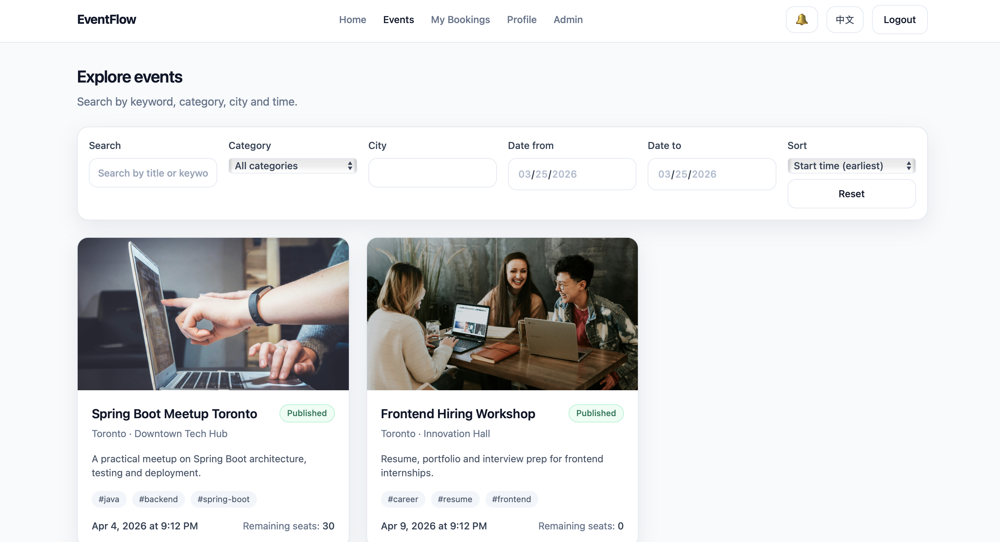
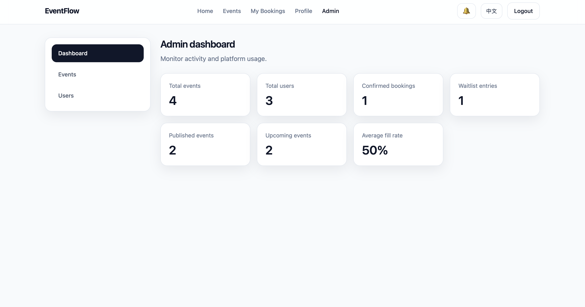

# EventFlow

[简体中文](./README_zh.md)

**EventFlow** is a full-stack **event booking and waitlist platform** built to showcase real business workflows, modern web engineering, and backend consistency design.

It goes beyond a basic CRUD app by handling **seat limits, duplicate registration protection, waitlist promotion, role-based admin workflows, multilingual UI, caching, asynchronous notifications, containerized deployment, and CI automation**.

## Preview

| Product Experience | Admin Experience |
| --- | --- |
|  |  |

## What the product does

EventFlow supports three roles and a complete event registration lifecycle:

- **Guest** users can browse featured events, search the event catalog, and view event details.
- **Users** can register, sign in, book an event, join the waitlist when an event is full, cancel their booking, and review their own bookings and notifications.
- **Admins** can create draft events, publish or cancel them, manage registrations, inspect waitlist order, and monitor platform-level statistics.

The core business flow is designed around real product constraints:

- limited event capacity
- registration deadline enforcement
- duplicate registration prevention
- automatic waitlist admission when seats are freed
- asynchronous user notifications
- role-based access control for admin operations

## Feature highlights

### User-facing product
- Featured events landing page with a modern card-based catalog
- Event list with keyword search, category filter, city filter, date filter, and sorting
- Event detail page with seat availability, registration state, tags, and booking actions
- Account flows for registration, sign-in, profile management, and language preference
- “My Bookings” view for confirmed bookings, waitlist entries, and cancelled history
- English and Simplified Chinese UI with persisted language switching

### Business workflow and platform logic
- Event lifecycle management with `DRAFT`, `PUBLISHED`, `CLOSED`, and `CANCELLED` states
- Capacity-aware booking that falls back to a waitlist when an event is full
- Duplicate active registration protection
- Waitlist promotion in queue order after cancellations
- Internal notification pipeline for booking confirmation, waitlist join, promotion, and cancellation events
- Redis-backed caching for featured and frequently accessed event queries

### Admin experience
- Dashboard cards for event, user, booking, and waitlist metrics
- Event creation, editing, publishing, closing, and cancellation workflows
- Registration and waitlist management views for each event
- User overview page with booking participation summary

## Tech stack

| Layer | Technologies |
| --- | --- |
| Frontend | React 18, TypeScript, Vite, Tailwind CSS, React Router, Zustand, Axios, react-i18next |
| Backend | Java 21, Spring Boot 3, Spring Security, JWT, Spring Data JPA, Bean Validation, Flyway, Springdoc OpenAPI |
| Data & Messaging | PostgreSQL, Redis, RabbitMQ |
| Testing | JUnit 5, Mockito, Spring Security Test, Vitest, React Testing Library |
| DevOps | Docker, Docker Compose, Nginx, GitHub Actions |

## Demo accounts

| Role | Email | Password |
| --- | --- | --- |
| Admin | `admin@eventflow.local` | `Admin123!` |
| User | `alice@eventflow.local` | `User123!` |
| User | `bob@eventflow.local` | `User123!` |

## Developer experience

- REST API documented through Swagger UI
- Docker Compose orchestration for frontend, backend, PostgreSQL, Redis, RabbitMQ, and Nginx
- Seed data for immediate product walkthroughs
- CI workflow covering backend tests and packaging, plus frontend lint, tests, and build

## Quick start

### Run the full stack with Docker

```bash
docker compose up --build
```

### Main endpoints

- Frontend: `http://localhost:4173`
- Backend API: `http://localhost:8080/api/v1`
- Swagger UI: `http://localhost:8080/swagger-ui.html`
- RabbitMQ Management: `http://localhost:15672`

## Resume-ready summary

**EventFlow** is a resume-grade full-stack platform that demonstrates how to build a complete product around constrained inventory-style transactions, multilingual UI, role-based admin tooling, and production-oriented delivery.
